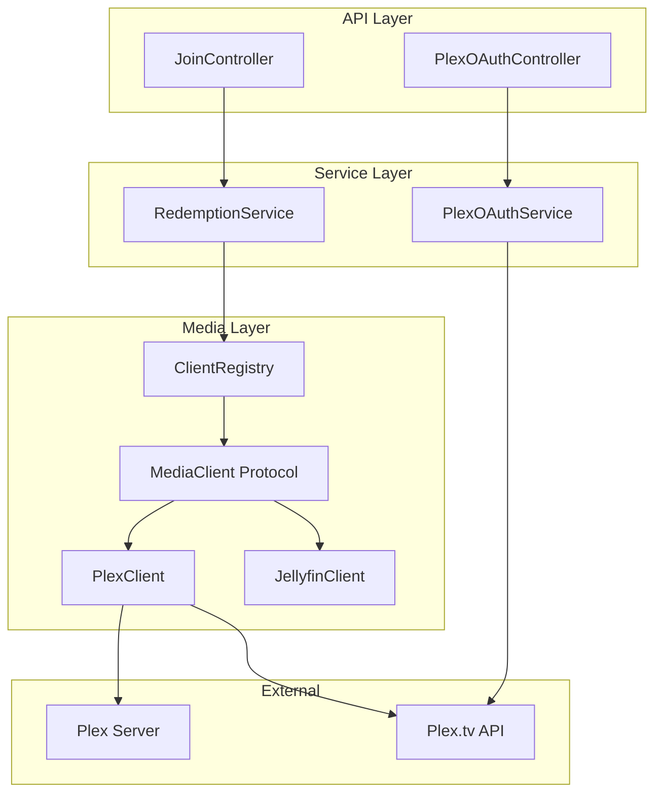

# Design Document: Plex Integration

## Overview

This design document describes the implementation of Plex media server integration for Zondarr (Phase 3). The integration enables Zondarr to manage user access to Plex servers through the existing invitation system, following the established MediaClient protocol pattern used by the Jellyfin implementation.

The key challenges addressed by this design are:

1. **Synchronous Library Wrapping**: python-plexapi is synchronous, requiring `asyncio.to_thread()` for all operations
2. **Dual User Types**: Plex has Friends (external Plex.tv accounts) and Home Users (managed accounts)
3. **OAuth Authentication**: Plex uses OAuth for user authentication rather than username/password
4. **Limited Capabilities**: Plex cannot enable/disable users (only delete), affecting capability declaration
5. **Different Library Model**: Plex uses "sections" rather than Jellyfin's "virtual folders"

## Architecture

The Plex integration follows the existing media client architecture:



### Component Responsibilities

- **PlexClient**: Implements MediaClient protocol for Plex servers
- **PlexOAuthService**: Handles Plex OAuth PIN generation and verification
- **PlexOAuthController**: Exposes OAuth endpoints for the join flow
- **RedemptionService**: Orchestrates user creation (existing, minor modifications)

## Components and Interfaces

### PlexClient Class

The PlexClient implements the MediaClient protocol, wrapping all python-plexapi calls in `asyncio.to_thread()`. Follows Python 3.14 conventions with deferred annotations and `Self` type.

```python
from collections.abc import Sequence
from typing import Self

import structlog
from plexapi.myplex import MyPlexAccount
from plexapi.server import PlexServer

from zondarr.media.exceptions import MediaClientError
from zondarr.media.types import Capability, ExternalUser, LibraryInfo, PlexUserType

log = structlog.get_logger()

class PlexClient:
    """Plex media server client implementing MediaClient protocol.

    Uses python-plexapi (synchronous) with asyncio.to_thread() for all
    blocking operations to avoid blocking the event loop.

    Attributes:
        url: The Plex server URL.
        api_key: The X-Plex-Token for authentication.
    """

    url: str
    api_key: str
    _server: PlexServer | None
    _account: MyPlexAccount | None

    def __init__(self, *, url: str, api_key: str) -> None:
        """Initialize PlexClient with keyword-only parameters."""
        self.url = url
        self.api_key = api_key
        self._server = None
        self._account = None

    @classmethod
    def capabilities(cls) -> set[Capability]:
        """Return capabilities: CREATE_USER, DELETE_USER, LIBRARY_ACCESS.

        Note: Plex does NOT support ENABLE_DISABLE_USER or DOWNLOAD_PERMISSION.
        """
        return {
            Capability.CREATE_USER,
            Capability.DELETE_USER,
            Capability.LIBRARY_ACCESS,
        }

    async def __aenter__(self) -> Self: ...
    async def __aexit__(
        self,
        exc_type: type[BaseException] | None,
        exc_val: BaseException | None,
        exc_tb: object,
    ) -> None: ...

    async def test_connection(self) -> bool: ...
    async def get_libraries(self) -> Sequence[LibraryInfo]: ...
    async def create_user(
        self,
        username: str,
        password: str,  # Ignored for Plex (uses OAuth or managed users)
        /,
        *,
        email: str | None = None,
        plex_user_type: PlexUserType = PlexUserType.FRIEND,
    ) -> ExternalUser: ...
    async def delete_user(self, external_user_id: str, /) -> bool: ...
    async def set_user_enabled(
        self,
        external_user_id: str,
        /,
        *,
        enabled: bool,
    ) -> bool: ...
    async def set_library_access(
        self,
        external_user_id: str,
        library_ids: Sequence[str],
        /,
    ) -> bool: ...
    async def update_permissions(
        self,
        external_user_id: str,
        /,
        *,
        permissions: dict[str, bool],
    ) -> bool: ...
    async def list_users(self) -> Sequence[ExternalUser]: ...
```

### PlexUserType Enum

New type to distinguish between Friend and Home user creation:

```python
class PlexUserType(StrEnum):
    """Type of Plex user to create."""
    FRIEND = "friend"      # External Plex.tv account via inviteFriend()
    HOME = "home"          # Managed user via createHomeUser()
```

### PlexOAuthService Class

Handles Plex OAuth PIN-based authentication flow. Uses httpx for async HTTP requests to Plex.tv API.

```python
from datetime import datetime

import httpx
import structlog

log = structlog.get_logger()

# Plex.tv API endpoints
PLEX_TV_PINS_URL = "https://plex.tv/api/v2/pins"
PLEX_TV_USER_URL = "https://plex.tv/api/v2/user"

class PlexOAuthService:
    """Service for Plex OAuth PIN-based authentication.

    Implements the Plex PIN-based OAuth flow:
    1. Generate PIN via POST to plex.tv/api/v2/pins
    2. User authenticates at plex.tv/link with PIN code
    3. Poll PIN status to retrieve auth token
    4. Use token to fetch user email
    """

    _http_client: httpx.AsyncClient
    _client_id: str  # X-Plex-Client-Identifier

    def __init__(self, *, client_id: str) -> None:
        """Initialize with Plex client identifier."""
        self._client_id = client_id
        self._http_client = httpx.AsyncClient()

    async def create_pin(self) -> PlexOAuthPin:
        """Generate a Plex OAuth PIN and return auth URL."""
        ...

    async def check_pin(self, pin_id: int) -> PlexOAuthResult | None:
        """Check if PIN has been authenticated, return token if so."""
        ...

    async def get_user_email(self, auth_token: str) -> str:
        """Retrieve user's Plex email from auth token."""
        ...

    async def close(self) -> None:
        """Close HTTP client."""
        await self._http_client.aclose()
```

### PlexOAuthController

New controller for OAuth endpoints following Litestar patterns with dependency injection:

```python
from collections.abc import Mapping, Sequence
from typing import Annotated

from litestar import Controller, get, post
from litestar.di import Provide
from litestar.params import Parameter
from litestar.status_codes import HTTP_200_OK, HTTP_404_NOT_FOUND, HTTP_410_GONE
from litestar.types import AnyCallable

class PlexOAuthController(Controller):
    """Controller for Plex OAuth flow endpoints.

    Provides public endpoints for the Plex OAuth PIN-based authentication
    flow used during invitation redemption.
    """

    path: str = "/api/v1/join/plex/oauth"
    tags: Sequence[str] | None = ["Plex OAuth"]
    dependencies: Mapping[str, Provide | AnyCallable] | None = {
        "oauth_service": Provide(provide_plex_oauth_service),
    }

    @post(
        "/pin",
        status_code=HTTP_200_OK,
        summary="Create Plex OAuth PIN",
        description="Generate a PIN for Plex OAuth authentication.",
        exclude_from_auth=True,
    )
    async def create_pin(
        self,
        oauth_service: PlexOAuthService,
    ) -> PlexOAuthPinResponse:
        """Generate OAuth PIN and return auth URL."""
        ...

    @get(
        "/pin/{pin_id:int}",
        status_code=HTTP_200_OK,
        summary="Check Plex OAuth PIN status",
        description="Check if a PIN has been authenticated.",
        exclude_from_auth=True,
    )
    async def check_pin(
        self,
        pin_id: Annotated[int, Parameter(description="PIN ID to check")],
        oauth_service: PlexOAuthService,
    ) -> PlexOAuthCheckResponse:
        """Check if PIN has been authenticated."""
        ...
```

### API Schemas

New msgspec Structs for Plex OAuth following project conventions:

```python
import msgspec
from datetime import datetime

class PlexOAuthPinResponse(msgspec.Struct, omit_defaults=True, kw_only=True):
    """Response from PIN creation.

    Attributes:
        pin_id: The PIN identifier for status checking.
        code: The PIN code to display to the user.
        auth_url: URL where user authenticates (plex.tv/link).
        expires_at: When the PIN expires.
    """
    pin_id: int
    code: str
    auth_url: str
    expires_at: datetime

class PlexOAuthCheckResponse(msgspec.Struct, omit_defaults=True, kw_only=True):
    """Response from PIN status check.

    Attributes:
        authenticated: Whether the PIN has been authenticated.
        email: User's Plex email (only if authenticated).
        error: Error message (only if failed).
    """
    authenticated: bool
    email: str | None = None
    error: str | None = None
```

## Data Models

### New Types in media/types.py

```python
class PlexUserType(StrEnum):
    """Type of Plex user to create.

    FRIEND: External Plex.tv account invited via inviteFriend()
    HOME: Managed user within Plex Home via createHomeUser()
    """
    FRIEND = "friend"
    HOME = "home"

class PlexUserInfo(msgspec.Struct, omit_defaults=True, kw_only=True):
    """Extended user info for Plex users.

    Includes Plex-specific fields not in the base ExternalUser.
    """
    external_user_id: str
    username: str
    email: str | None = None
    user_type: PlexUserType = PlexUserType.FRIEND
    is_home_user: bool = False
    thumb: str | None = None  # Avatar URL
```

### OAuth State Storage

For the OAuth flow, we need temporary storage for pending PINs. Options:

1. **In-memory dict** (simple, loses state on restart)
2. **Database table** (persistent, more complex)
3. **Redis/cache** (if available)

For simplicity, we'll use an in-memory dict with TTL cleanup, since OAuth PINs are short-lived (typically 15 minutes).

```python
@dataclass
class PendingPlexOAuth:
    """Pending Plex OAuth authentication."""
    pin_id: int
    code: str  # Invitation code being redeemed
    created_at: datetime
    expires_at: datetime
```

## Plex API Integration Details

### Connection Initialization

```python
async def __aenter__(self) -> Self:
    def _connect() -> tuple[PlexServer, MyPlexAccount]:
        server = PlexServer(self.url, self.api_key)
        account = server.myPlexAccount()
        return server, account

    self._server, self._account = await asyncio.to_thread(_connect)
    return self
```

### Friend Invitation Flow

```python
async def _create_friend(self, email: str, library_ids: Sequence[str]) -> ExternalUser:
    def _invite() -> MyPlexUser:
        sections = [self._server.library.sectionByID(lid) for lid in library_ids]
        return self._account.inviteFriend(email, self._server, sections)

    user = await asyncio.to_thread(_invite)
    return ExternalUser(
        external_user_id=str(user.id),
        username=user.username or email,
        email=email,
    )
```

### Home User Creation Flow

```python
async def _create_home_user(self, username: str) -> ExternalUser:
    def _create() -> MyPlexUser:
        return self._account.createHomeUser(username, self._server)

    user = await asyncio.to_thread(_create)
    return ExternalUser(
        external_user_id=str(user.id),
        username=user.username,
        email=None,
    )
```

### Library Section Mapping

Plex libraries are accessed via section keys:

```python
async def get_libraries(self) -> Sequence[LibraryInfo]:
    def _get_sections() -> list[LibrarySection]:
        return self._server.library.sections()

    sections = await asyncio.to_thread(_get_sections)
    return [
        LibraryInfo(
            external_id=str(section.key),
            name=section.title,
            library_type=section.type,  # 'movie', 'show', 'artist', etc.
        )
        for section in sections
    ]
```


## Correctness Properties

*A property is a characteristic or behavior that should hold true across all valid executions of a system—essentially, a formal statement about what the system should do. Properties serve as the bridge between human-readable specifications and machine-verifiable correctness guarantees.*

### Property 1: Context Manager Round-Trip

*For any* PlexClient instance with valid URL and API key, entering the async context and then exiting should result in the client being in a clean state with `_server` and `_account` set to None.

**Validates: Requirements 1.1, 1.2**

### Property 2: Connection Test Return Value Correctness

*For any* PlexClient instance, `test_connection()` should return True if and only if the server is reachable and the token is valid; otherwise it should return False without raising an exception.

**Validates: Requirements 1.3, 1.4, 1.5**

### Property 3: Library Retrieval Produces Valid Structs

*For any* connected PlexClient with accessible libraries, `get_libraries()` should return a sequence where each element is a valid LibraryInfo with non-empty `external_id`, `name`, and `library_type` fields.

**Validates: Requirements 3.1, 3.2**

### Property 4: Friend Creation Returns Valid ExternalUser

*For any* valid email address and connected PlexClient, creating a Friend user should return an ExternalUser where `external_user_id` is non-empty and `email` matches the input email.

**Validates: Requirements 4.1, 4.2**

### Property 5: Home User Creation Returns Valid ExternalUser

*For any* valid username and connected PlexClient, creating a Home User should return an ExternalUser where `external_user_id` is non-empty and `username` matches the input username.

**Validates: Requirements 5.1, 5.2**

### Property 6: User Type Routing Correctness

*For any* call to `create_user`, if `plex_user_type` is FRIEND and email is provided, the Friend creation path is used; if `plex_user_type` is HOME, the Home User creation path is used; if `plex_user_type` is FRIEND but no email is provided, MediaClientError is raised.

**Validates: Requirements 6.1, 6.2, 6.3, 6.4**

### Property 7: Delete User Return Value Correctness

*For any* connected PlexClient and user identifier, `delete_user()` should return True if the user existed and was deleted, False if the user was not found, and raise MediaClientError only for other failures.

**Validates: Requirements 7.1, 7.2, 7.3, 7.4, 7.5**

### Property 8: Library Access Update Return Value Correctness

*For any* connected PlexClient, valid user identifier, and library ID list, `set_library_access()` should return True if the user exists and access was updated, False if the user was not found.

**Validates: Requirements 8.1, 8.2, 8.3, 9.1, 9.2, 9.3**

### Property 9: Permission Update Mapping and Return Value

*For any* connected PlexClient, valid user identifier, and permissions dict containing `can_download`, `update_permissions()` should map `can_download` to the Plex `allowSync` setting and return True on success, False if user not found.

**Validates: Requirements 11.1, 11.2, 11.3, 11.5**

### Property 10: List Users Returns All Users as ExternalUser Structs

*For any* connected PlexClient, `list_users()` should return a sequence containing all Friends and Home Users, where each element is a valid ExternalUser with non-empty `external_user_id` and `username`.

**Validates: Requirements 12.1, 12.2, 12.3**

### Property 11: OAuth PIN Generation Returns Valid Response

*For any* call to `create_pin()`, the response should contain a positive `pin_id`, a non-empty `auth_url` starting with "https://", and an `expires_at` in the future.

**Validates: Requirements 13.1, 13.2**

### Property 12: OAuth PIN Verification Retrieves Email on Success

*For any* authenticated PIN, `check_pin()` should return a result with `authenticated=True` and a non-empty `email` field containing a valid email address.

**Validates: Requirements 14.1, 14.2, 14.3**

### Property 13: Redemption Rollback on Failure

*For any* invitation targeting multiple servers where user creation succeeds on some servers but fails on a Plex server, all previously created users should be deleted and no local Identity/User records should be created.

**Validates: Requirements 15.5**

### Property 14: Error Structure Contains Required Fields

*For any* MediaClientError raised by PlexClient, the error should contain non-empty `operation` field, and the `server_url` should match the client's configured URL.

**Validates: Requirements 17.1**

## Error Handling

### PlexClient Errors

All PlexClient operations follow a consistent error handling pattern:

1. **Not Initialized**: If called outside async context, raise `MediaClientError` with operation name and cause "API client is None"

2. **User Not Found**: Return `False` for operations that modify users (delete, set_library_access, update_permissions, set_user_enabled)

3. **Duplicate User**: Raise `MediaClientError` with `error_code="USER_ALREADY_EXISTS"` for Friends or `error_code="USERNAME_TAKEN"` for Home Users

4. **API Failures**: Wrap python-plexapi exceptions in `MediaClientError` with the original exception message as `cause`

5. **Connection Failures**: `test_connection()` returns `False` without raising; other methods raise `MediaClientError`

### Error Code Mapping

| Plex Error | MediaClientError Code |
|------------|----------------------|
| User already shared | USER_ALREADY_EXISTS |
| Username taken | USERNAME_TAKEN |
| User not found | (return False) |
| Invalid token | INVALID_TOKEN |
| Server unreachable | CONNECTION_ERROR |
| Email required for Friend | EMAIL_REQUIRED |

### OAuth Errors

| Scenario | Response |
|----------|----------|
| PIN generation fails | 500 with error details |
| PIN not found | 404 with "PIN not found" |
| PIN expired | 410 with "PIN expired" |
| PIN not yet authenticated | 200 with authenticated=False |
| Email retrieval fails | 500 with error details |

## Testing Strategy

### Dual Testing Approach

The Plex integration uses both unit tests and property-based tests:

- **Unit tests**: Verify specific examples, edge cases, mocked API responses
- **Property tests**: Verify universal properties across generated inputs using Hypothesis

### Property-Based Testing Configuration

- **Library**: Hypothesis (already in project dependencies)
- **Minimum iterations**: 100 per property test
- **Tag format**: `Feature: plex-integration, Property {number}: {property_text}`

### Test Structure

```
backend/tests/
├── unit/
│   └── media/
│       └── clients/
│           └── test_plex.py          # Unit tests with mocked plexapi
├── property/
│   └── media/
│       └── clients/
│           └── test_plex_props.py    # Property-based tests
└── integration/
    └── media/
        └── test_plex_integration.py  # Integration tests (optional, requires real server)
```

### Mocking Strategy

Since python-plexapi requires a real Plex server, all unit and property tests will mock the plexapi classes:

```python
@pytest.fixture
def mock_plex_server():
    """Mock PlexServer for testing."""
    with patch("plexapi.server.PlexServer") as mock:
        server = MagicMock()
        server.library.sections.return_value = [...]
        mock.return_value = server
        yield server

@pytest.fixture
def mock_myplex_account():
    """Mock MyPlexAccount for testing."""
    with patch.object(PlexServer, "myPlexAccount") as mock:
        account = MagicMock()
        account.inviteFriend.return_value = MagicMock(id=123, username="test")
        mock.return_value = account
        yield account
```

### Hypothesis Strategies

Custom strategies for generating test data:

```python
from hypothesis import strategies as st

# Valid email addresses
emails = st.emails()

# Valid usernames (alphanumeric, 3-32 chars)
usernames = st.text(
    alphabet=st.characters(whitelist_categories=("L", "N")),
    min_size=3,
    max_size=32,
)

# Library IDs (numeric strings)
library_ids = st.lists(
    st.integers(min_value=1, max_value=1000).map(str),
    min_size=0,
    max_size=10,
)

# Plex user types
user_types = st.sampled_from([PlexUserType.FRIEND, PlexUserType.HOME])

# Permission dicts
permissions = st.fixed_dictionaries({
    "can_download": st.booleans(),
    "can_stream": st.booleans(),
    "can_transcode": st.booleans(),
    "can_sync": st.booleans(),
})
```

### Test Coverage Goals

| Component | Unit Test Coverage | Property Test Coverage |
|-----------|-------------------|----------------------|
| PlexClient | All public methods | Properties 1-10, 14 |
| PlexOAuthService | All methods | Properties 11-12 |
| RedemptionService (Plex) | Plex-specific paths | Property 13 |

### Example Property Test

```python
# Feature: plex-integration, Property 3: Library Retrieval Produces Valid Structs
@given(
    sections=st.lists(
        st.fixed_dictionaries({
            "key": st.integers(min_value=1),
            "title": st.text(min_size=1, max_size=100),
            "type": st.sampled_from(["movie", "show", "artist", "photo"]),
        }),
        min_size=0,
        max_size=20,
    )
)
@settings(max_examples=100)
async def test_get_libraries_returns_valid_structs(sections, mock_plex_server):
    """Property 3: get_libraries returns valid LibraryInfo structs."""
    # Arrange
    mock_sections = [MagicMock(key=s["key"], title=s["title"], type=s["type"]) for s in sections]
    mock_plex_server.library.sections.return_value = mock_sections

    client = PlexClient(url="http://test:32400", api_key="test-token")

    # Act
    async with client:
        libraries = await client.get_libraries()

    # Assert
    assert len(libraries) == len(sections)
    for lib in libraries:
        assert lib.external_id  # non-empty
        assert lib.name  # non-empty
        assert lib.library_type  # non-empty
```
