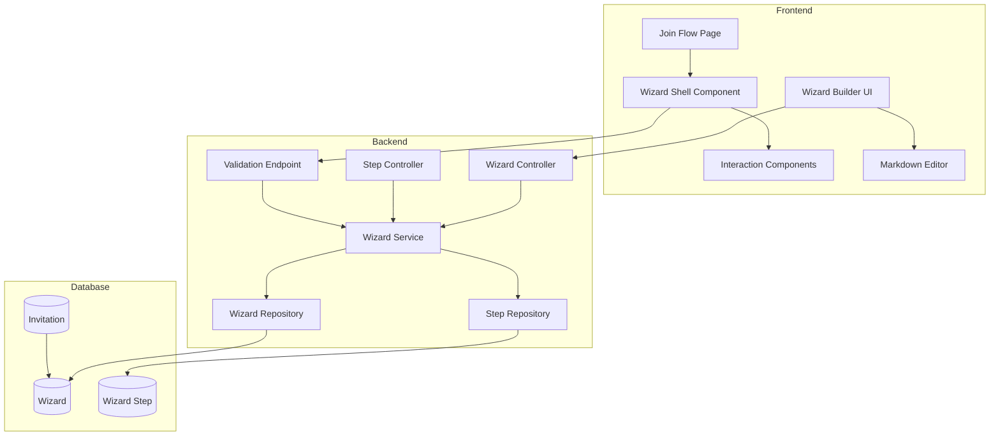
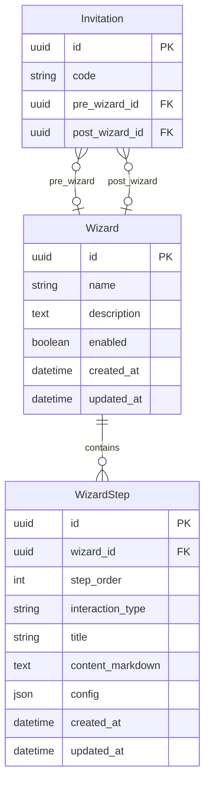

# Design Document: Wizard System

## Overview

The Wizard System provides a configurable multi-step onboarding flow for invitation redemption. Administrators can create wizards with various interaction types (click, timer, tos, text_input, quiz) and associate them with invitations to run before and/or after account creation.

The system follows Zondarr's layered architecture:
- **Backend**: SQLAlchemy models → Repositories → Services → Litestar Controllers with msgspec DTOs
- **Frontend**: SvelteKit routes → Page components → Feature components (wizard shell, interactions) → API client

## UI Design Direction

### Aesthetic Vision: "Cinematic Onboarding"

The wizard UI adopts a **cinematic, immersive aesthetic** that transforms mundane onboarding into an engaging experience. Think movie credits meets premium streaming service—dramatic, focused, and memorable.

**Design Principles:**
- **Focused Attention**: Each step commands full attention with generous negative space and centered content
- **Progressive Revelation**: Content fades in with staggered animations, building anticipation
- **Dramatic Typography**: Bold, cinematic headings with refined body text
- **Atmospheric Depth**: Subtle gradients, soft glows, and layered shadows create depth

### Typography

```css
/* Wizard typography - distinctive, not generic */
--font-wizard-display: 'Instrument Serif', 'Playfair Display', Georgia, serif;
--font-wizard-body: 'Satoshi', 'DM Sans', system-ui, sans-serif;
--font-wizard-mono: 'JetBrains Mono', 'Fira Code', monospace;
```

- **Step Titles**: Display font at 2.5rem, letter-spacing -0.02em, dramatic weight
- **Content Body**: Body font at 1.125rem, generous line-height (1.7), comfortable reading
- **Timer Display**: Monospace font, tabular-nums, oversized for impact

### Color Theme

```css
/* Wizard-specific color tokens extending Zondarr palette */
--wizard-bg: hsl(220 20% 4%);           /* Deep charcoal, almost black */
--wizard-surface: hsl(220 15% 8%);       /* Elevated surface */
--wizard-border: hsl(220 10% 18%);       /* Subtle borders */
--wizard-text: hsl(220 10% 92%);         /* High contrast text */
--wizard-text-muted: hsl(220 10% 60%);   /* Secondary text */
--wizard-accent: hsl(45 90% 55%);        /* Warm gold accent */
--wizard-accent-glow: hsl(45 90% 55% / 0.15); /* Accent glow effect */
--wizard-success: hsl(150 60% 45%);      /* Completion green */
--wizard-error: hsl(0 70% 55%);          /* Error red */
```

### Motion Design

**Page Load Sequence:**
```css
/* Staggered reveal animation */
@keyframes wizard-reveal {
    from {
        opacity: 0;
        transform: translateY(20px);
    }
    to {
        opacity: 1;
        transform: translateY(0);
    }
}

.wizard-step-title { animation: wizard-reveal 0.6s ease-out 0.1s both; }
.wizard-step-content { animation: wizard-reveal 0.6s ease-out 0.2s both; }
.wizard-step-interaction { animation: wizard-reveal 0.6s ease-out 0.3s both; }
.wizard-navigation { animation: wizard-reveal 0.6s ease-out 0.4s both; }
```

**Micro-interactions:**
- Progress bar: Smooth width transition with subtle glow pulse on completion
- Buttons: Scale on hover (1.02), subtle shadow lift
- Timer: Pulse animation on final 5 seconds
- Quiz options: Border glow on hover, checkmark animation on selection

### Spatial Composition

- **Centered Layout**: Max-width 640px, centered with generous vertical padding
- **Step Cards**: Floating appearance with subtle shadow and border
- **Progress Indicator**: Thin horizontal bar at top, minimal but visible
- **Navigation**: Fixed at bottom with backdrop blur for floating effect

### Visual Details

- **Background**: Subtle radial gradient from center, creating depth
- **Card Surface**: Slight transparency with backdrop-blur for glass effect
- **Accent Glow**: Soft gold glow behind primary action buttons
- **Timer Ring**: Circular progress indicator with gradient stroke

## Architecture



## Components and Interfaces

### Backend Components

#### Wizard Model (`backend/src/zondarr/models/wizard.py`)

```python
class InteractionType(StrEnum):
    """Supported wizard step interaction types."""
    CLICK = "click"
    TIMER = "timer"
    TOS = "tos"
    TEXT_INPUT = "text_input"
    QUIZ = "quiz"


class Wizard(Base, UUIDPrimaryKeyMixin, TimestampMixin):
    """A configurable wizard flow for invitation redemption."""
    __tablename__ = "wizards"

    name: Mapped[str] = mapped_column(String(255))
    description: Mapped[str | None] = mapped_column(Text, default=None)
    enabled: Mapped[bool] = mapped_column(Boolean, default=True)

    steps: Mapped[list[WizardStep]] = relationship(
        back_populates="wizard",
        cascade="all, delete-orphan",
        lazy="selectin",
        order_by="WizardStep.step_order",
    )


class WizardStep(Base, UUIDPrimaryKeyMixin, TimestampMixin):
    """A single step within a wizard."""
    __tablename__ = "wizard_steps"

    wizard_id: Mapped[UUID] = mapped_column(ForeignKey("wizards.id", ondelete="CASCADE"))
    step_order: Mapped[int] = mapped_column(Integer)
    interaction_type: Mapped[InteractionType] = mapped_column()
    title: Mapped[str] = mapped_column(String(255))
    content_markdown: Mapped[str] = mapped_column(Text)
    config: Mapped[dict[str, Any]] = mapped_column(JSON, default=dict)

    wizard: Mapped[Wizard] = relationship(back_populates="steps", lazy="joined")

    __table_args__ = (
        UniqueConstraint("wizard_id", "step_order", name="uq_wizard_step_order"),
    )
```

#### Wizard API Schemas (`backend/src/zondarr/api/schemas.py` additions)

```python
# Request schemas
class WizardCreate(msgspec.Struct, kw_only=True, forbid_unknown_fields=True):
    name: NonEmptyStr
    description: str | None = None
    enabled: bool = True


class WizardUpdate(msgspec.Struct, kw_only=True, forbid_unknown_fields=True):
    name: NonEmptyStr | None = None
    description: str | None = None
    enabled: bool | None = None


class WizardStepCreate(msgspec.Struct, kw_only=True, forbid_unknown_fields=True):
    interaction_type: Annotated[str, msgspec.Meta(pattern=r"^(click|timer|tos|text_input|quiz)$")]
    title: NonEmptyStr
    content_markdown: str
    config: dict[str, Any] = {}
    step_order: int | None = None  # Auto-assigned if not provided


class WizardStepUpdate(msgspec.Struct, kw_only=True, forbid_unknown_fields=True):
    title: NonEmptyStr | None = None
    content_markdown: str | None = None
    config: dict[str, Any] | None = None


class StepReorderRequest(msgspec.Struct, kw_only=True, forbid_unknown_fields=True):
    new_order: Annotated[int, msgspec.Meta(ge=0)]


class StepValidationRequest(msgspec.Struct, kw_only=True, forbid_unknown_fields=True):
    step_id: UUID
    response: dict[str, Any]  # Type-specific response data
    started_at: datetime | None = None  # For timer validation


# Response schemas
class WizardStepResponse(msgspec.Struct, omit_defaults=True):
    id: UUID
    wizard_id: UUID
    step_order: int
    interaction_type: str
    title: str
    content_markdown: str
    config: dict[str, Any]
    created_at: datetime
    updated_at: datetime | None = None


class WizardResponse(msgspec.Struct, omit_defaults=True):
    id: UUID
    name: str
    enabled: bool
    created_at: datetime
    description: str | None = None
    updated_at: datetime | None = None


class WizardDetailResponse(msgspec.Struct, omit_defaults=True):
    id: UUID
    name: str
    enabled: bool
    created_at: datetime
    steps: list[WizardStepResponse]
    description: str | None = None
    updated_at: datetime | None = None


class StepValidationResponse(msgspec.Struct, kw_only=True):
    valid: bool
    completion_token: str | None = None
    error: str | None = None
```

#### Wizard Controller (`backend/src/zondarr/api/wizards.py`)

```python
class WizardController(Controller):
    """Controller for wizard management endpoints."""
    path = "/api/v1/wizards"
    tags = ["Wizards"]

    @post("/", status_code=HTTP_201_CREATED)
    async def create_wizard(self, data: WizardCreate, wizard_service: WizardService) -> WizardResponse: ...

    @get("/")
    async def list_wizards(self, wizard_service: WizardService, page: int = 1, page_size: int = 50) -> WizardListResponse: ...

    @get("/{wizard_id:uuid}")
    async def get_wizard(self, wizard_id: UUID, wizard_service: WizardService) -> WizardDetailResponse: ...

    @patch("/{wizard_id:uuid}")
    async def update_wizard(self, wizard_id: UUID, data: WizardUpdate, wizard_service: WizardService) -> WizardResponse: ...

    @delete("/{wizard_id:uuid}", status_code=HTTP_204_NO_CONTENT)
    async def delete_wizard(self, wizard_id: UUID, wizard_service: WizardService) -> None: ...

    @post("/{wizard_id:uuid}/steps", status_code=HTTP_201_CREATED)
    async def create_step(self, wizard_id: UUID, data: WizardStepCreate, wizard_service: WizardService) -> WizardStepResponse: ...

    @patch("/{wizard_id:uuid}/steps/{step_id:uuid}")
    async def update_step(self, wizard_id: UUID, step_id: UUID, data: WizardStepUpdate, wizard_service: WizardService) -> WizardStepResponse: ...

    @delete("/{wizard_id:uuid}/steps/{step_id:uuid}", status_code=HTTP_204_NO_CONTENT)
    async def delete_step(self, wizard_id: UUID, step_id: UUID, wizard_service: WizardService) -> None: ...

    @post("/{wizard_id:uuid}/steps/{step_id:uuid}/reorder")
    async def reorder_step(self, wizard_id: UUID, step_id: UUID, data: StepReorderRequest, wizard_service: WizardService) -> WizardStepResponse: ...

    @post("/validate-step", exclude_from_auth=True)
    async def validate_step(self, data: StepValidationRequest, wizard_service: WizardService) -> StepValidationResponse: ...
```

#### Wizard Service (`backend/src/zondarr/services/wizard.py`)

```python
class WizardService:
    """Business logic for wizard operations."""

    def __init__(self, wizard_repo: WizardRepository, step_repo: WizardStepRepository) -> None: ...

    async def create_wizard(self, name: str, description: str | None, enabled: bool) -> Wizard: ...
    async def get_wizard(self, wizard_id: UUID) -> Wizard: ...
    async def list_wizards(self, page: int, page_size: int) -> tuple[list[Wizard], int]: ...
    async def update_wizard(self, wizard_id: UUID, **updates: Any) -> Wizard: ...
    async def delete_wizard(self, wizard_id: UUID) -> None: ...

    async def create_step(self, wizard_id: UUID, interaction_type: str, title: str, content_markdown: str, config: dict[str, Any], step_order: int | None) -> WizardStep: ...
    async def update_step(self, wizard_id: UUID, step_id: UUID, **updates: Any) -> WizardStep: ...
    async def delete_step(self, wizard_id: UUID, step_id: UUID) -> None: ...
    async def reorder_step(self, wizard_id: UUID, step_id: UUID, new_order: int) -> WizardStep: ...

    async def validate_step(self, step_id: UUID, response: dict[str, Any], started_at: datetime | None) -> tuple[bool, str | None]: ...
```

### Frontend Components

#### Directory Structure

```
frontend/src/lib/components/wizard/
├── wizard-shell.svelte           # Main wizard orchestrator
├── wizard-progress.svelte        # Progress indicator component
├── wizard-navigation.svelte      # Back/Next/Complete buttons
├── wizard-builder.svelte         # Admin wizard editor
├── step-editor.svelte            # Individual step configuration
├── markdown-editor.svelte        # Content authoring with preview
├── interactions/
│   ├── click-interaction.svelte
│   ├── timer-interaction.svelte
│   ├── tos-interaction.svelte
│   ├── text-input-interaction.svelte
│   ├── quiz-interaction.svelte
│   └── index.ts                  # Barrel export
├── __tests__/
│   ├── wizard-shell.test.ts
│   ├── interactions.test.ts
│   └── validation.property.test.ts
└── index.ts                      # Barrel export
```

#### Wizard Shell (`frontend/src/lib/components/wizard/wizard-shell.svelte`)

Uses Svelte 5 Runes for explicit reactivity:

```svelte
<script lang="ts">
import type { Snippet } from 'svelte';
import type { WizardDetailResponse, WizardStepResponse } from '$lib/api/types';
import { validateStep } from '$lib/api/client';
import WizardProgress from './wizard-progress.svelte';
import WizardNavigation from './wizard-navigation.svelte';
import {
    ClickInteraction,
    TimerInteraction,
    TosInteraction,
    TextInputInteraction,
    QuizInteraction
} from './interactions';

interface Props {
    wizard: WizardDetailResponse;
    onComplete: () => void;
    onCancel?: () => void;
}

let { wizard, onComplete, onCancel }: Props = $props();

// Reactive state with $state
let currentStepIndex = $state(0);
let stepResponses = $state<Map<string, StepResponse>>(new Map());
let isValidating = $state(false);
let validationError = $state<string | null>(null);

// Derived values with $derived (NOT $effect for state derivation)
const currentStep = $derived(wizard.steps[currentStepIndex]);
const isFirstStep = $derived(currentStepIndex === 0);
const isLastStep = $derived(currentStepIndex === wizard.steps.length - 1);
const progress = $derived(((currentStepIndex + 1) / wizard.steps.length) * 100);
const canProceed = $derived(stepResponses.has(currentStep?.id ?? ''));

// Persist progress to sessionStorage
$effect(() => {
    if (typeof sessionStorage !== 'undefined') {
        sessionStorage.setItem(
            `wizard-${wizard.id}-progress`,
            JSON.stringify({
                stepIndex: currentStepIndex,
                responses: Array.from(stepResponses.entries())
            })
        );
    }
});

async function handleNext() {
    if (!canProceed || isValidating) return;

    const response = stepResponses.get(currentStep.id);
    if (!response) return;

    isValidating = true;
    validationError = null;

    try {
        const result = await validateStep({
            step_id: currentStep.id,
            response: response.data,
            started_at: response.startedAt
        });

        if (!result.data?.valid) {
            validationError = result.data?.error ?? 'Validation failed';
            return;
        }

        if (isLastStep) {
            onComplete();
        } else {
            currentStepIndex++;
        }
    } finally {
        isValidating = false;
    }
}

function handleBack() {
    if (!isFirstStep) {
        currentStepIndex--;
        validationError = null;
    }
}

function handleStepComplete(response: StepResponse) {
    stepResponses.set(currentStep.id, response);
    // Trigger reactivity by reassigning
    stepResponses = new Map(stepResponses);
}
</script>

<div class="flex flex-col gap-6">
    <WizardProgress current={currentStepIndex + 1} total={wizard.steps.length} {progress} />

    <div class="prose prose-sm dark:prose-invert max-w-none">
        {@html renderedMarkdown}
    </div>

    {#if currentStep.interaction_type === 'click'}
        <ClickInteraction step={currentStep} onComplete={handleStepComplete} />
    {:else if currentStep.interaction_type === 'timer'}
        <TimerInteraction step={currentStep} onComplete={handleStepComplete} />
    {:else if currentStep.interaction_type === 'tos'}
        <TosInteraction step={currentStep} onComplete={handleStepComplete} />
    {:else if currentStep.interaction_type === 'text_input'}
        <TextInputInteraction step={currentStep} onComplete={handleStepComplete} />
    {:else if currentStep.interaction_type === 'quiz'}
        <QuizInteraction step={currentStep} onComplete={handleStepComplete} />
    {/if}

    {#if validationError}
        <p class="text-destructive text-sm">{validationError}</p>
    {/if}

    <WizardNavigation
        {isFirstStep}
        {isLastStep}
        {canProceed}
        loading={isValidating}
        onBack={handleBack}
        onNext={handleNext}
        {onCancel}
    />
</div>
```

#### Interaction Component Interface

Each interaction component follows Svelte 5 patterns with `$props()`:

```typescript
// types.ts
export interface StepResponse {
    stepId: string;
    interactionType: string;
    data: Record<string, unknown>;
    startedAt?: string;  // ISO timestamp for timer validation
    completedAt: string; // ISO timestamp
}

// Example: click-interaction.svelte
<script lang="ts">
import type { WizardStepResponse } from '$lib/api/types';
import type { StepResponse } from './types';
import { Button } from '$lib/components/ui/button';

interface Props {
    step: WizardStepResponse;
    onComplete: (response: StepResponse) => void;
    disabled?: boolean;
}

let { step, onComplete, disabled = false }: Props = $props();

const buttonText = $derived(step.config.button_text ?? 'I Understand');

function handleClick() {
    onComplete({
        stepId: step.id,
        interactionType: 'click',
        data: { acknowledged: true },
        completedAt: new Date().toISOString()
    });
}
</script>

<Button onclick={handleClick} {disabled}>{buttonText}</Button>
```

#### Timer Interaction with Countdown

```svelte
<script lang="ts">
import type { WizardStepResponse } from '$lib/api/types';
import type { StepResponse } from './types';
import { Button } from '$lib/components/ui/button';
import { onMount } from 'svelte';

interface Props {
    step: WizardStepResponse;
    onComplete: (response: StepResponse) => void;
    disabled?: boolean;
}

let { step, onComplete, disabled = false }: Props = $props();

const durationSeconds = $derived(step.config.duration_seconds ?? 10);
let remainingSeconds = $state(durationSeconds);
let startedAt = $state<string | null>(null);
const isComplete = $derived(remainingSeconds <= 0);

// Format remaining time as MM:SS
const formattedTime = $derived.by(() => {
    const mins = Math.floor(remainingSeconds / 60);
    const secs = remainingSeconds % 60;
    return `${mins}:${secs.toString().padStart(2, '0')}`;
});

onMount(() => {
    startedAt = new Date().toISOString();
    const interval = setInterval(() => {
        if (remainingSeconds > 0) {
            remainingSeconds--;
        }
    }, 1000);
    return () => clearInterval(interval);
});

function handleComplete() {
    onComplete({
        stepId: step.id,
        interactionType: 'timer',
        data: { waited: true },
        startedAt: startedAt ?? undefined,
        completedAt: new Date().toISOString()
    });
}
</script>

<div class="flex flex-col items-center gap-4">
    <div class="text-4xl font-mono tabular-nums">{formattedTime}</div>
    <Button onclick={handleComplete} disabled={!isComplete || disabled}>
        {isComplete ? 'Continue' : 'Please wait...'}
    </Button>
</div>
```

#### Wizard Builder (`frontend/src/lib/components/wizard/wizard-builder.svelte`)

Admin interface using Svelte 5 patterns:

```svelte
<script lang="ts">
import type { WizardDetailResponse, WizardStepResponse } from '$lib/api/types';
import { createWizard, updateWizard, createStep, updateStep, deleteStep, reorderStep } from '$lib/api/client';
import { toast } from 'svelte-sonner';
import StepEditor from './step-editor.svelte';
import MarkdownEditor from './markdown-editor.svelte';
import { Button } from '$lib/components/ui/button';
import { Input } from '$lib/components/ui/input';
import { Label } from '$lib/components/ui/label';
import { Switch } from '$lib/components/ui/switch';
import * as Card from '$lib/components/ui/card';

interface Props {
    wizard?: WizardDetailResponse;
    onSave?: (wizard: WizardDetailResponse) => void;
    onCancel?: () => void;
}

let { wizard, onSave, onCancel }: Props = $props();

// Form state
let name = $state(wizard?.name ?? '');
let description = $state(wizard?.description ?? '');
let enabled = $state(wizard?.enabled ?? true);
let steps = $state<WizardStepResponse[]>(wizard?.steps ?? []);
let isSaving = $state(false);
let editingStepId = $state<string | null>(null);

const isEditing = $derived(!!wizard?.id);
const editingStep = $derived(steps.find(s => s.id === editingStepId));

async function handleSave() { /* ... */ }
async function handleAddStep() { /* ... */ }
async function handleDeleteStep(stepId: string) { /* ... */ }
async function handleReorderStep(stepId: string, newOrder: number) { /* ... */ }
</script>
```

#### Zod Validation Schemas (`frontend/src/lib/schemas/wizard.ts`)

```typescript
import { z } from 'zod';

export const wizardSchema = z.object({
    name: z.string().min(1, 'Name is required').max(255),
    description: z.string().max(2000).optional(),
    enabled: z.boolean().default(true)
});

export const clickConfigSchema = z.object({
    button_text: z.string().max(100).optional()
});

export const timerConfigSchema = z.object({
    duration_seconds: z.number().int().min(1).max(300)
});

export const tosConfigSchema = z.object({
    checkbox_label: z.string().max(200).optional()
});

export const textInputConfigSchema = z.object({
    label: z.string().min(1).max(100),
    placeholder: z.string().max(200).optional(),
    required: z.boolean().default(true),
    min_length: z.number().int().min(0).optional(),
    max_length: z.number().int().min(1).optional()
});

export const quizConfigSchema = z.object({
    question: z.string().min(1).max(500),
    options: z.array(z.string().min(1).max(200)).min(2).max(10),
    correct_answer_index: z.number().int().min(0)
}).refine(
    data => data.correct_answer_index < data.options.length,
    { message: 'correct_answer_index must be a valid option index' }
);

export type WizardInput = z.infer<typeof wizardSchema>;
export type ClickConfig = z.infer<typeof clickConfigSchema>;
export type TimerConfig = z.infer<typeof timerConfigSchema>;
export type TosConfig = z.infer<typeof tosConfigSchema>;
export type TextInputConfig = z.infer<typeof textInputConfigSchema>;
export type QuizConfig = z.infer<typeof quizConfigSchema>;
```

## Data Models

### Database Schema



### Step Configuration Schemas

Each interaction type has a specific configuration schema stored in the `config` JSON field:

```typescript
// Click interaction config
interface ClickConfig {
    button_text?: string; // Default: "I Understand"
}

// Timer interaction config
interface TimerConfig {
    duration_seconds: number; // Required: 1-300
}

// TOS interaction config
interface TosConfig {
    checkbox_label?: string; // Default: "I accept the terms of service"
}

// Text input interaction config
interface TextInputConfig {
    label: string;
    placeholder?: string;
    required?: boolean;      // Default: true
    min_length?: number;
    max_length?: number;
}

// Quiz interaction config
interface QuizConfig {
    question: string;
    options: string[];           // Minimum 2 options
    correct_answer_index: number;
}
```

### Invitation Model Updates

Add to existing Invitation model:

```python
class Invitation(Base, UUIDPrimaryKeyMixin, TimestampMixin):
    # ... existing fields ...

    pre_wizard_id: Mapped[UUID | None] = mapped_column(
        ForeignKey("wizards.id", ondelete="SET NULL"),
        default=None,
    )
    post_wizard_id: Mapped[UUID | None] = mapped_column(
        ForeignKey("wizards.id", ondelete="SET NULL"),
        default=None,
    )

    pre_wizard: Mapped[Wizard | None] = relationship(
        foreign_keys=[pre_wizard_id],
        lazy="selectin",
    )
    post_wizard: Mapped[Wizard | None] = relationship(
        foreign_keys=[post_wizard_id],
        lazy="selectin",
    )
```


## Correctness Properties

*A property is a characteristic or behavior that should hold true across all valid executions of a system—essentially, a formal statement about what the system should do. Properties serve as the bridge between human-readable specifications and machine-verifiable correctness guarantees.*

### Property 1: Wizard Model Round-Trip

*For any* valid wizard data (name, description, enabled), creating a wizard and then retrieving it SHALL return equivalent data for all fields.

**Validates: Requirements 1.1, 2.1, 2.3**

### Property 2: WizardStep Model Round-Trip

*For any* valid wizard step data (interaction_type, title, content_markdown, config), creating a step and then retrieving it SHALL return equivalent data for all fields.

**Validates: Requirements 1.2, 3.1**

### Property 3: Cascade Delete Integrity

*For any* wizard with N steps (where N >= 0), deleting the wizard SHALL result in all N associated steps being deleted from the database.

**Validates: Requirements 1.3, 2.5**

### Property 4: Step Order Uniqueness

*For any* wizard, attempting to create two steps with the same step_order SHALL fail with a constraint violation error.

**Validates: Requirements 1.4**

### Property 5: Interaction Type Validation

*For any* step creation request, the interaction_type field SHALL only accept values from the set {click, timer, tos, text_input, quiz}. Any other value SHALL be rejected with a validation error.

**Validates: Requirements 1.5**

### Property 6: Step Order Contiguity

*For any* wizard with steps, after any step deletion or reorder operation, the step_order values SHALL form a contiguous sequence starting from 0 (i.e., 0, 1, 2, ..., N-1 for N steps).

**Validates: Requirements 3.4, 3.5**

### Property 7: Timer Duration Bounds

*For any* timer step configuration, the duration_seconds field SHALL be validated to be within the range [1, 300]. Values outside this range SHALL be rejected.

**Validates: Requirements 5.4**

### Property 8: Quiz Configuration Completeness

*For any* quiz step configuration, the config SHALL require: a non-empty question string, an options array with at least 2 elements, and a correct_answer_index that is a valid index into the options array.

**Validates: Requirements 8.2, 8.3**

### Property 9: Quiz Answer Validation

*For any* quiz step and any answer submission, the validation endpoint SHALL return valid=true if and only if the submitted answer_index equals the correct_answer_index in the step config.

**Validates: Requirements 8.4, 8.5, 9.3**

### Property 10: Text Input Constraint Validation

*For any* text_input step with configured constraints (required, min_length, max_length), the validation endpoint SHALL return valid=false for: empty input when required=true, input shorter than min_length, or input longer than max_length.

**Validates: Requirements 7.3, 7.4, 9.4**

### Property 11: Timer Duration Validation

*For any* timer step validation request, the validation endpoint SHALL return valid=true if and only if the elapsed time (current_time - started_at) is greater than or equal to duration_seconds.

**Validates: Requirements 9.2**

### Property 12: Invitation-Wizard Cascade Null

*For any* invitation referencing a wizard (via pre_wizard_id or post_wizard_id), deleting that wizard SHALL set the corresponding invitation field to null rather than deleting the invitation.

**Validates: Requirements 10.4**

### Property 13: Markdown XSS Sanitization

*For any* markdown content containing script tags, event handlers, or javascript: URLs, the rendered HTML output SHALL have these potentially malicious elements removed or escaped.

**Validates: Requirements 15.3**

## Error Handling

### Backend Error Handling

| Error Condition | HTTP Status | Error Code | Response |
|----------------|-------------|------------|----------|
| Wizard not found | 404 | WIZARD_NOT_FOUND | `{"detail": "Wizard not found", "error_code": "WIZARD_NOT_FOUND"}` |
| Step not found | 404 | STEP_NOT_FOUND | `{"detail": "Step not found", "error_code": "STEP_NOT_FOUND"}` |
| Invalid interaction type | 400 | VALIDATION_ERROR | `{"detail": "Invalid interaction type", "field_errors": [...]}` |
| Duplicate step order | 400 | CONSTRAINT_VIOLATION | `{"detail": "Step order already exists", "error_code": "CONSTRAINT_VIOLATION"}` |
| Invalid timer duration | 400 | VALIDATION_ERROR | `{"detail": "duration_seconds must be between 1 and 300"}` |
| Invalid quiz config | 400 | VALIDATION_ERROR | `{"detail": "Quiz requires at least 2 options"}` |
| Step validation failed | 400 | VALIDATION_FAILED | `{"valid": false, "error": "Incorrect answer"}` |
| Timer not elapsed | 400 | VALIDATION_FAILED | `{"valid": false, "error": "Timer not complete"}` |

### Frontend Error Handling

- **Network errors**: Display toast notification with retry option
- **Validation errors**: Display inline error messages on form fields
- **Step validation failures**: Display error message within the interaction component
- **Session storage unavailable**: Fall back to in-memory state (wizard progress lost on refresh)

## Testing Strategy

### Property-Based Testing

Property-based tests will use **Hypothesis** (backend) and **fast-check** (frontend) to verify correctness properties across many generated inputs.

**Backend (pytest + pytest-asyncio + hypothesis)**:
- Minimum 100 iterations per property test
- Each test tagged with: `# Feature: wizard-system, Property N: {property_text}`
- Focus on model operations, validation logic, and API behavior

```python
# backend/tests/property/test_wizard_properties.py
import hypothesis.strategies as st
from hypothesis import given, settings

# Feature: wizard-system, Property 5: Interaction Type Validation
@given(interaction_type=st.text())
@settings(max_examples=100)
async def test_interaction_type_validation(interaction_type: str):
    """Only valid interaction types are accepted."""
    valid_types = {"click", "timer", "tos", "text_input", "quiz"}
    # ... test implementation
```

**Frontend (vitest + fast-check)**:
- Minimum 100 iterations per property test
- Test files using Runes must have `.svelte.test.ts` extension
- Focus on validation logic, markdown sanitization, and state management

```typescript
// frontend/src/lib/components/wizard/__tests__/validation.property.test.ts
import { describe, it, expect } from 'vitest';
import * as fc from 'fast-check';
import { sanitizeMarkdown } from '../utils';

// Feature: wizard-system, Property 13: Markdown XSS Sanitization
describe('Markdown XSS Sanitization', () => {
    it('removes script tags from any markdown input', () => {
        fc.assert(
            fc.property(fc.string(), (content) => {
                const withScript = `${content}<script>alert('xss')</script>`;
                const result = sanitizeMarkdown(withScript);
                expect(result).not.toContain('<script');
            }),
            { numRuns: 100 }
        );
    });
});
```

### Unit Testing

Unit tests complement property tests for:
- Specific edge cases (empty wizard, single step, max steps)
- Error condition handling
- Integration points between components
- API endpoint response formats

**Component Testing with Testing Library**:

```typescript
// frontend/src/lib/components/wizard/__tests__/wizard-shell.test.ts
import { render, screen } from '@testing-library/svelte';
import userEvent from '@testing-library/user-event';
import WizardShell from '../wizard-shell.svelte';

describe('WizardShell', () => {
    it('disables Back button on first step', async () => {
        const wizard = createMockWizard(3);
        render(WizardShell, { props: { wizard, onComplete: vi.fn() } });

        const backButton = screen.getByRole('button', { name: /back/i });
        expect(backButton).toBeDisabled();
    });

    it('shows Complete button on last step', async () => {
        const user = userEvent.setup();
        const wizard = createMockWizard(1);
        render(WizardShell, { props: { wizard, onComplete: vi.fn() } });

        expect(screen.getByRole('button', { name: /complete/i })).toBeInTheDocument();
    });
});
```

### Test Organization

```
backend/tests/
├── property/
│   └── test_wizard_properties.py    # Property-based tests (hypothesis)
├── unit/
│   └── test_wizard_service.py       # Unit tests for service layer
├── api/
│   └── test_wizard_endpoints.py     # API integration tests
└── conftest.py                      # Shared fixtures

frontend/src/lib/components/wizard/
├── __tests__/
│   ├── wizard-shell.test.ts         # Component tests
│   ├── wizard-shell.svelte.test.ts  # Tests using Runes
│   ├── interactions.test.ts         # Interaction component tests
│   └── validation.property.test.ts  # Property-based validation tests (fast-check)
```

### Test Coverage Requirements

- All correctness properties must have corresponding property-based tests
- All API endpoints must have integration tests
- All interaction components must have unit tests for their validation logic
- Markdown sanitization must have security-focused tests with known XSS vectors
- Use `flushSync()` when testing `$derived` values in Svelte 5 components
