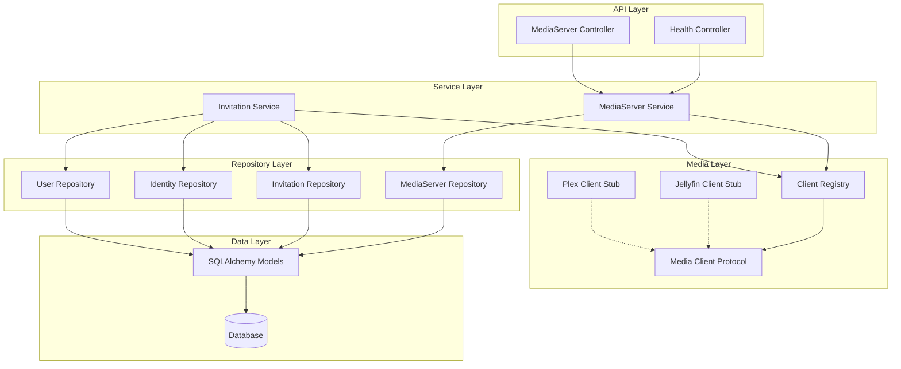

# Design Document: Zondarr Foundation

## Overview

The Zondarr Foundation establishes the core infrastructure for a unified invitation and user management system for media servers. This design leverages Python 3.14+ features, Litestar's elegant architecture, msgspec's high-performance serialization, and SQLAlchemy 2.0's async patterns.

The foundation provides:
- A modular, feature-based project structure
- SQLAlchemy 2.0 async database models with proper relationships
- A Protocol-based media client abstraction with registry pattern
- Repository and service layers for clean separation of concerns
- A Litestar application with health endpoints and OpenAPI documentation

## Architecture



### Layered Architecture

The system follows a strict layered architecture:

1. **API Layer**: Litestar controllers handle HTTP requests, validation, and response serialization
2. **Service Layer**: Business logic orchestration, transaction management, cross-cutting concerns
3. **Repository Layer**: Data access abstraction, query building, entity mapping
4. **Media Layer**: Protocol-based abstraction for external media server communication
5. **Data Layer**: SQLAlchemy models, database connection management

### Dependency Flow

Dependencies flow downward only. Upper layers depend on abstractions (protocols/interfaces) of lower layers, enabling testability and flexibility.

## Components and Interfaces

### pyproject.toml Configuration

Updates to the existing `backend/pyproject.toml` using uv build backend:

```toml
[project]
name = "zondarr"
version = "0.1.0"
description = "Unified invitation and user management for media servers"
readme = "README.md"
license = "AGPL-3.0-only"
authors = [
    { name = "engels74", email = "141435164+engels74@users.noreply.github.com" }
]
requires-python = ">=3.14"
dependencies = [
    "litestar>=2.15",
    "msgspec>=0.19",
    "granian>=2.6",
    "sqlalchemy[asyncio]>=2.0",
    "aiosqlite>=0.21",
    "asyncpg>=0.30",
    "alembic>=1.15",
    "structlog>=25.0",
    "httpx>=0.28",
    "plexapi>=4.18",       # python-plexapi for Plex server communication
    "jellyfin-sdk>=0.3",   # Modern Jellyfin SDK (Python 3.13+)
]

[project.optional-dependencies]
dev = [
    "pytest>=8.3",
    "pytest-asyncio>=0.26",
    "pytest-cov>=6.0",
    "hypothesis>=6.130",
    "ruff>=0.14",
    "basedpyright>=1.29",
]

[project.scripts]
zondarr = "zondarr.cli:main"

[build-system]
requires = ["uv_build>=0.9.28,<0.10.0"]
build-backend = "uv_build"

[tool.ruff]
line-length = 88
target-version = "py314"

[tool.ruff.lint]
select = ["E4", "E7", "E9", "F", "I", "B", "UP", "S", "C4", "RUF"]
ignore = ["E501"]

[tool.ruff.lint.per-file-ignores]
"tests/**" = ["S101"]
"__init__.py" = ["F401"]

[tool.ruff.format]
quote-style = "double"
docstring-code-format = true

[tool.basedpyright]
typeCheckingMode = "recommended"
pythonVersion = "3.14"

[tool.pytest.ini_options]
minversion = "8.0"
testpaths = ["tests"]
pythonpath = ["src"]
addopts = ["-ra", "-q", "--strict-markers", "--import-mode=importlib"]
asyncio_mode = "auto"
asyncio_default_fixture_loop_scope = "function"
```

### Project Structure

```
backend/
├── src/
│   └── zondarr/
│       ├── __init__.py
│       ├── app.py                 # Litestar application factory
│       ├── config.py              # Configuration with environment loading
│       ├── core/
│       │   ├── __init__.py
│       │   ├── database.py        # Engine, session factory, base model
│       │   ├── exceptions.py      # Domain exceptions
│       │   └── types.py           # Shared type definitions
│       ├── media/
│       │   ├── __init__.py
│       │   ├── protocol.py        # MediaClient protocol definition
│       │   ├── registry.py        # Client registry singleton
│       │   ├── types.py           # LibraryInfo, ExternalUser, Capability
│       │   ├── exceptions.py      # MediaClientError and subtypes
│       │   └── clients/
│       │       ├── __init__.py
│       │       ├── jellyfin.py    # Jellyfin client stub
│       │       └── plex.py        # Plex client stub
│       ├── models/
│       │   ├── __init__.py
│       │   ├── base.py            # Base model with common fields
│       │   ├── media_server.py    # MediaServer, Library models
│       │   ├── invitation.py      # Invitation, association tables
│       │   └── identity.py        # Identity, User models
│       ├── repositories/
│       │   ├── __init__.py
│       │   ├── base.py            # Generic repository base
│       │   ├── media_server.py    # MediaServerRepository
│       │   ├── invitation.py      # InvitationRepository
│       │   ├── identity.py        # IdentityRepository
│       │   └── user.py            # UserRepository
│       ├── services/
│       │   ├── __init__.py
│       │   ├── media_server.py    # MediaServerService
│       │   └── invitation.py      # InvitationService
│       └── api/
│           ├── __init__.py
│           ├── health.py          # Health check controller
│           ├── schemas.py         # Request/response msgspec Structs
│           └── errors.py          # Error response handling
├── migrations/
│   ├── env.py
│   └── versions/
│       └── 001_initial.py
├── tests/
├── alembic.ini
└── pyproject.toml
```

### Configuration Module

Uses msgspec.Struct with validation constraints. Note: msgspec validates during decode, not at init time.

```python
# config.py
import msgspec
import os
from typing import Annotated

class Settings(msgspec.Struct, kw_only=True, forbid_unknown_fields=True):
    """Application settings loaded from environment variables.

    Uses Python 3.14 deferred annotations - no forward reference quotes needed.
    """

    # Database
    database_url: Annotated[str, msgspec.Meta(
        description="Database connection URL (sqlite+aiosqlite:// or postgresql+asyncpg://)"
    )] = "sqlite+aiosqlite:///./zondarr.db"

    # Server
    host: str = "0.0.0.0"
    port: Annotated[int, msgspec.Meta(ge=1, le=65535)] = 8000
    debug: bool = False

    # Security
    secret_key: Annotated[str, msgspec.Meta(min_length=32)]


def load_settings() -> Settings:
    """Load and validate settings from environment variables.

    Uses walrus operator for cleaner required value handling.
    Raises ConfigurationError if required values are missing.
    """
    from .core.exceptions import ConfigurationError

    # Check required values first (fail fast)
    if (secret_key := os.environ.get("SECRET_KEY")) is None:
        raise ConfigurationError(
            "SECRET_KEY environment variable is required",
            "MISSING_CONFIG",
            field="SECRET_KEY",
        )

    # Build settings dict for validation via msgspec.convert
    settings_dict = {
        "database_url": os.environ.get("DATABASE_URL", "sqlite+aiosqlite:///./zondarr.db"),
        "host": os.environ.get("HOST", "0.0.0.0"),
        "port": int(os.environ.get("PORT", "8000")),
        "debug": os.environ.get("DEBUG", "").lower() in ("true", "1", "yes"),
        "secret_key": secret_key,
    }

    # msgspec.convert validates constraints
    return msgspec.convert(settings_dict, Settings)
```

### Media Client Protocol

Uses Python's typing.Protocol for structural subtyping (no inheritance required). Leverages Python 3.14 deferred annotations.

```python
# media/protocol.py
from typing import Protocol, Self
from collections.abc import Sequence
from .types import LibraryInfo, ExternalUser, Capability

class MediaClient(Protocol):
    """Protocol defining the interface for media server clients.

    Implementations must support async context manager for connection lifecycle.
    Uses Python 3.14 deferred annotations - no forward reference quotes needed.
    Uses Self type for proper return type in subclasses.
    """

    @classmethod
    def capabilities(cls) -> set[Capability]:
        """Return the set of capabilities this client supports."""
        ...

    async def __aenter__(self) -> Self:
        """Enter async context, establishing connection."""
        ...

    async def __aexit__(self, exc_type, exc_val, exc_tb) -> None:
        """Exit async context, cleaning up resources."""
        ...

    async def test_connection(self) -> bool:
        """Test connectivity to the media server."""
        ...

    async def get_libraries(self) -> Sequence[LibraryInfo]:
        """Retrieve all libraries from the media server."""
        ...

    async def create_user(
        self,
        username: str,
        password: str,
        email: str | None = None,
    ) -> ExternalUser:
        """Create a new user on the media server."""
        ...

    async def delete_user(self, external_user_id: str) -> bool:
        """Delete a user from the media server."""
        ...

    async def set_user_enabled(self, external_user_id: str, /, *, enabled: bool) -> bool:
        """Enable or disable a user on the media server.

        Uses positional-only for external_user_id, keyword-only for enabled.
        """
        ...

    async def set_library_access(
        self,
        external_user_id: str,
        library_ids: Sequence[str],
    ) -> bool:
        """Set which libraries a user can access."""
        ...
```

### Client Registry

Uses ClassVar for singleton pattern. Type parameter syntax for generic client creation.

```python
# media/registry.py
from typing import ClassVar
from .protocol import MediaClient
from .types import Capability, ServerType
from .exceptions import UnknownServerTypeError

class ClientRegistry:
    """Singleton registry for media client implementations.

    Uses ClassVar for singleton instance storage.
    """

    _instance: ClassVar[ClientRegistry | None] = None
    _clients: dict[ServerType, type[MediaClient]]

    def __new__(cls) -> ClientRegistry:
        if cls._instance is None:
            cls._instance = super().__new__(cls)
            cls._instance._clients = {}
        return cls._instance

    def register(self, server_type: ServerType, client_class: type[MediaClient]) -> None:
        """Register a client implementation for a server type."""
        self._clients[server_type] = client_class

    def get_client_class(self, server_type: ServerType) -> type[MediaClient]:
        """Get the client class for a server type.

        Uses walrus operator for cleaner lookup.
        """
        if (client_class := self._clients.get(server_type)) is None:
            raise UnknownServerTypeError(server_type)
        return client_class

    def get_capabilities(self, server_type: ServerType) -> set[Capability]:
        """Get capabilities for a server type."""
        return self.get_client_class(server_type).capabilities()

    def create_client(self, server_type: ServerType, /, *, url: str, api_key: str) -> MediaClient:
        """Create a client instance for a media server.

        Uses positional-only for server_type, keyword-only for credentials.
        """
        client_class = self.get_client_class(server_type)
        return client_class(url=url, api_key=api_key)


# Global registry instance
registry = ClientRegistry()
```

### Media Client Implementations

The foundation phase includes stub implementations for both Jellyfin and Plex clients. Full implementations will be added in Phase 2 (Jellyfin) and Phase 3 (Plex).

**Jellyfin Client**: Uses `jellyfin-sdk` (webysther/jellyfin-sdk-python) - a modern Python 3.13+ SDK that provides high-level abstractions over the Jellyfin API with support for method chaining, JSONPath, and more.

**Plex Client**: Uses `python-plexapi` (PlexAPI v4.18+) library for Plex server communication. Note that PlexAPI is synchronous, so the Plex client will use `asyncio.to_thread()` to run operations without blocking the event loop.

```python
# media/clients/plex.py (stub for foundation phase)
from typing import Self
from collections.abc import Sequence
import asyncio
from ..protocol import MediaClient
from ..types import LibraryInfo, ExternalUser, Capability
from ..exceptions import MediaClientError

class PlexClient:
    """Plex media server client.

    Uses python-plexapi (PlexAPI v4.18+) for server communication.
    PlexAPI is synchronous, so operations use asyncio.to_thread().

    Full implementation in Phase 3.
    """

    def __init__(self, *, url: str, api_key: str) -> None:
        self.url = url
        self.api_key = api_key
        self._server = None  # PlexServer instance

    @classmethod
    def capabilities(cls) -> set[Capability]:
        return {
            Capability.CREATE_USER,
            Capability.DELETE_USER,
            Capability.LIBRARY_ACCESS,
            # Plex-specific capabilities added in Phase 3
        }

    async def __aenter__(self) -> Self:
        # Will use asyncio.to_thread() for PlexServer connection
        return self

    async def __aexit__(self, exc_type, exc_val, exc_tb) -> None:
        pass

    async def test_connection(self) -> bool:
        raise NotImplementedError("Plex client implementation in Phase 3")

    async def get_libraries(self) -> Sequence[LibraryInfo]:
        raise NotImplementedError("Plex client implementation in Phase 3")

    async def create_user(
        self,
        username: str,
        password: str,
        email: str | None = None,
    ) -> ExternalUser:
        raise NotImplementedError("Plex client implementation in Phase 3")

    async def delete_user(self, external_user_id: str) -> bool:
        raise NotImplementedError("Plex client implementation in Phase 3")

    async def set_user_enabled(self, external_user_id: str, /, *, enabled: bool) -> bool:
        raise NotImplementedError("Plex client implementation in Phase 3")

    async def set_library_access(
        self,
        external_user_id: str,
        library_ids: Sequence[str],
    ) -> bool:
        raise NotImplementedError("Plex client implementation in Phase 3")


# media/clients/jellyfin.py (stub for foundation phase)
class JellyfinClient:
    """Jellyfin media server client.

    Uses jellyfin-sdk (webysther/jellyfin-sdk-python) - a modern Python 3.13+ SDK
    with high-level abstractions, method chaining, and JSONPath support.

    Full implementation in Phase 2.
    """

    def __init__(self, *, url: str, api_key: str) -> None:
        self.url = url
        self.api_key = api_key
        self._api = None  # jellyfin.api instance

    @classmethod
    def capabilities(cls) -> set[Capability]:
        return {
            Capability.CREATE_USER,
            Capability.DELETE_USER,
            Capability.ENABLE_DISABLE_USER,
            Capability.LIBRARY_ACCESS,
            Capability.DOWNLOAD_PERMISSION,
            # Jellyfin-specific capabilities added in Phase 2
        }

    async def __aenter__(self) -> Self:
        # Initialize jellyfin-sdk api
        # import jellyfin
        # self._api = jellyfin.api(self.url, self.api_key)
        return self

    async def __aexit__(self, exc_type, exc_val, exc_tb) -> None:
        pass

    async def test_connection(self) -> bool:
        raise NotImplementedError("Jellyfin client implementation in Phase 2")

    async def get_libraries(self) -> Sequence[LibraryInfo]:
        raise NotImplementedError("Jellyfin client implementation in Phase 2")

    async def create_user(
        self,
        username: str,
        password: str,
        email: str | None = None,
    ) -> ExternalUser:
        raise NotImplementedError("Jellyfin client implementation in Phase 2")

    async def delete_user(self, external_user_id: str) -> bool:
        raise NotImplementedError("Jellyfin client implementation in Phase 2")

    async def set_user_enabled(self, external_user_id: str, /, *, enabled: bool) -> bool:
        raise NotImplementedError("Jellyfin client implementation in Phase 2")

    async def set_library_access(
        self,
        external_user_id: str,
        library_ids: Sequence[str],
    ) -> bool:
        raise NotImplementedError("Jellyfin client implementation in Phase 2")
```

### Repository Base

Uses PEP 695 type parameter syntax for generic repository. Explicit eager loading to avoid lazy load issues in async.

```python
# repositories/base.py
from uuid import UUID
from collections.abc import Sequence
from sqlalchemy import select
from sqlalchemy.ext.asyncio import AsyncSession
from ..models.base import Base
from ..core.exceptions import RepositoryError

class Repository[T: Base]:
    """Generic repository providing common CRUD operations.

    Uses PEP 695 type parameter syntax: class Repository[T: Base]
    T is bounded to Base model type.
    """

    model: type[T]

    def __init__(self, session: AsyncSession) -> None:
        self.session = session

    async def get_by_id(self, id: UUID) -> T | None:
        """Retrieve an entity by its ID."""
        try:
            return await self.session.get(self.model, id)
        except Exception as e:
            raise RepositoryError(
                f"Failed to get {self.model.__name__} by id",
                operation="get_by_id",
                original=e,
            )

    async def get_all(self) -> Sequence[T]:
        """Retrieve all entities."""
        try:
            result = await self.session.scalars(select(self.model))
            return result.all()
        except Exception as e:
            raise RepositoryError(
                f"Failed to get all {self.model.__name__}",
                operation="get_all",
                original=e,
            )

    async def create(self, entity: T) -> T:
        """Persist a new entity."""
        try:
            self.session.add(entity)
            await self.session.flush()
            return entity
        except Exception as e:
            raise RepositoryError(
                f"Failed to create {self.model.__name__}",
                operation="create",
                original=e,
            )

    async def delete(self, entity: T) -> None:
        """Remove an entity."""
        try:
            await self.session.delete(entity)
            await self.session.flush()
        except Exception as e:
            raise RepositoryError(
                f"Failed to delete {self.model.__name__}",
                operation="delete",
                original=e,
            )
```

### Health Controller

Uses Litestar controller pattern with proper dependency injection.

```python
# api/health.py
from litestar import Controller, get, Response
from litestar.status_codes import HTTP_200_OK, HTTP_503_SERVICE_UNAVAILABLE
from sqlalchemy.ext.asyncio import AsyncSession
from sqlalchemy import text
import msgspec

class HealthStatus(msgspec.Struct):
    status: str
    checks: dict[str, bool]

class HealthController(Controller):
    """Health check endpoints for monitoring and orchestration."""

    path = "/health"
    tags = ["Health"]

    @get("/", include_in_schema=False)
    async def health_check(self, session: AsyncSession) -> Response[HealthStatus]:
        """Overall health check including all dependencies."""
        checks = {
            "database": await self._check_database(session),
        }
        all_healthy = all(checks.values())
        return Response(
            HealthStatus(
                status="healthy" if all_healthy else "degraded",
                checks=checks,
            ),
            status_code=HTTP_200_OK if all_healthy else HTTP_503_SERVICE_UNAVAILABLE,
        )

    @get("/live", include_in_schema=False)
    async def liveness(self) -> dict[str, str]:
        """Kubernetes liveness probe - always returns OK if process is running."""
        return {"status": "alive"}

    @get("/ready", include_in_schema=False)
    async def readiness(self, session: AsyncSession) -> Response[dict[str, str]]:
        """Kubernetes readiness probe - checks if ready to serve traffic."""
        if await self._check_database(session):
            return Response({"status": "ready"}, status_code=HTTP_200_OK)
        return Response({"status": "not ready"}, status_code=HTTP_503_SERVICE_UNAVAILABLE)

    async def _check_database(self, session: AsyncSession) -> bool:
        """Check database connectivity."""
        try:
            await session.execute(text("SELECT 1"))
            return True
        except Exception:
            return False
```

### Application Factory

Uses Litestar's lifespan context managers and dependency injection with Provide.

```python
# app.py
from contextlib import asynccontextmanager
from collections.abc import AsyncGenerator

from litestar import Litestar
from litestar.di import Provide
from litestar.datastructures import State
from litestar.openapi import OpenAPIConfig
from litestar.openapi.plugins import SwaggerRenderPlugin, ScalarRenderPlugin
from litestar.plugins.structlog import StructlogPlugin, StructlogConfig
from sqlalchemy.ext.asyncio import create_async_engine, async_sessionmaker, AsyncSession

from .config import load_settings, Settings
from .api.health import HealthController
from .api.errors import validation_error_handler, not_found_handler, internal_error_handler
from .core.exceptions import ValidationError, NotFoundError
from .media.registry import registry
from .media.clients.jellyfin import JellyfinClient
from .media.clients.plex import PlexClient
from .models.media_server import ServerType


@asynccontextmanager
async def db_lifespan(app: Litestar) -> AsyncGenerator[None, None]:
    """Manage database connection pool lifecycle."""
    settings: Settings = app.state.settings
    engine = create_async_engine(
        settings.database_url,
        pool_pre_ping=True,
        echo=settings.debug,
    )
    app.state.session_factory = async_sessionmaker(engine, expire_on_commit=False)
    yield
    await engine.dispose()


async def provide_db_session(state: State) -> AsyncGenerator[AsyncSession, None]:
    """Provide database session with automatic commit/rollback."""
    async with state.session_factory() as session:
        try:
            yield session
            await session.commit()
        except Exception:
            await session.rollback()
            raise


def create_app(settings: Settings | None = None) -> Litestar:
    """Application factory for creating Litestar app instances.

    Supports dependency injection override for testing.
    """
    if settings is None:
        settings = load_settings()

    # Register media clients
    registry.register(ServerType.JELLYFIN, JellyfinClient)
    registry.register(ServerType.PLEX, PlexClient)

    return Litestar(
        route_handlers=[HealthController],
        lifespan=[db_lifespan],
        state=State({"settings": settings}),
        dependencies={
            "session": Provide(provide_db_session),
        },
        openapi_config=OpenAPIConfig(
            title="Zondarr API",
            version="0.1.0",
            description="Unified invitation and user management for media servers",
            path="/docs",
            render_plugins=[
                SwaggerRenderPlugin(path="/swagger"),
                ScalarRenderPlugin(path="/scalar"),
            ],
        ),
        plugins=[
            StructlogPlugin(config=StructlogConfig()),
        ],
        exception_handlers={
            ValidationError: validation_error_handler,
            NotFoundError: not_found_handler,
            Exception: internal_error_handler,
        },
        debug=settings.debug,
    )


# For Granian: granian zondarr.app:app --interface asgi
app = create_app()
```

## Data Models

### Base Model

Uses SQLAlchemy 2.0 Mapped types with proper timezone-aware datetimes.

```python
# models/base.py
from datetime import datetime, UTC
from uuid import UUID, uuid4
from sqlalchemy import func
from sqlalchemy.orm import DeclarativeBase, Mapped, mapped_column

class Base(DeclarativeBase):
    """Base model with common fields and behaviors."""
    pass

class TimestampMixin:
    """Mixin providing created_at and updated_at timestamps.

    Uses timezone-aware UTC datetimes.
    """

    created_at: Mapped[datetime] = mapped_column(
        default=lambda: datetime.now(UTC),
        server_default=func.now(),
    )
    updated_at: Mapped[datetime | None] = mapped_column(
        default=None,
        onupdate=lambda: datetime.now(UTC),
    )

class UUIDPrimaryKeyMixin:
    """Mixin providing UUID primary key."""

    id: Mapped[UUID] = mapped_column(
        primary_key=True,
        default=uuid4,
    )
```

### MediaServer and Library Models

Uses StrEnum for type-safe server types. Explicit eager loading with selectinload for relationships.

```python
# models/media_server.py
from enum import StrEnum
from uuid import UUID
from sqlalchemy import String, Boolean, ForeignKey
from sqlalchemy.orm import Mapped, mapped_column, relationship
from .base import Base, TimestampMixin, UUIDPrimaryKeyMixin

class ServerType(StrEnum):
    """Supported media server types."""
    JELLYFIN = "jellyfin"
    PLEX = "plex"

class MediaServer(Base, UUIDPrimaryKeyMixin, TimestampMixin):
    """A media server instance (Plex or Jellyfin)."""

    __tablename__ = "media_servers"

    name: Mapped[str] = mapped_column(String(255))
    server_type: Mapped[ServerType]
    url: Mapped[str] = mapped_column(String(2048))
    api_key: Mapped[str] = mapped_column(String(512))  # Encrypted at rest
    enabled: Mapped[bool] = mapped_column(Boolean, default=True)

    # Relationships - use selectinload for collections to avoid N+1
    libraries: Mapped[list["Library"]] = relationship(
        back_populates="media_server",
        cascade="all, delete-orphan",
        lazy="selectin",  # Eager load by default
    )

class Library(Base, UUIDPrimaryKeyMixin, TimestampMixin):
    """A content library within a media server."""

    __tablename__ = "libraries"

    media_server_id: Mapped[UUID] = mapped_column(ForeignKey("media_servers.id"))
    external_id: Mapped[str] = mapped_column(String(255))
    name: Mapped[str] = mapped_column(String(255))
    library_type: Mapped[str] = mapped_column(String(50))

    # Relationships - use joined for single relations
    media_server: Mapped["MediaServer"] = relationship(
        back_populates="libraries",
        lazy="joined",
    )
```

### Invitation Model

```python
# models/invitation.py
from datetime import datetime
from uuid import UUID
from sqlalchemy import String, Boolean, Integer, ForeignKey, Table, Column
from sqlalchemy.orm import Mapped, mapped_column, relationship
from .base import Base, TimestampMixin, UUIDPrimaryKeyMixin

# Association tables
invitation_servers = Table(
    "invitation_servers",
    Base.metadata,
    Column("invitation_id", ForeignKey("invitations.id"), primary_key=True),
    Column("media_server_id", ForeignKey("media_servers.id"), primary_key=True),
)

invitation_libraries = Table(
    "invitation_libraries",
    Base.metadata,
    Column("invitation_id", ForeignKey("invitations.id"), primary_key=True),
    Column("library_id", ForeignKey("libraries.id"), primary_key=True),
)

class Invitation(Base, UUIDPrimaryKeyMixin, TimestampMixin):
    __tablename__ = "invitations"

    code: Mapped[str] = mapped_column(String(20), unique=True, index=True)
    expires_at: Mapped[datetime | None] = mapped_column(default=None)
    max_uses: Mapped[int | None] = mapped_column(Integer, default=None)
    use_count: Mapped[int] = mapped_column(Integer, default=0)
    duration_days: Mapped[int | None] = mapped_column(Integer, default=None)
    enabled: Mapped[bool] = mapped_column(Boolean, default=True)
    created_by: Mapped[str | None] = mapped_column(String(255), default=None)

    # Relationships
    target_servers: Mapped[list["MediaServer"]] = relationship(
        secondary=invitation_servers,
    )
    allowed_libraries: Mapped[list["Library"]] = relationship(
        secondary=invitation_libraries,
    )
```

### Identity and User Models

```python
# models/identity.py
from datetime import datetime
from uuid import UUID
from sqlalchemy import String, Boolean, ForeignKey
from sqlalchemy.orm import Mapped, mapped_column, relationship
from .base import Base, TimestampMixin, UUIDPrimaryKeyMixin

class Identity(Base, UUIDPrimaryKeyMixin, TimestampMixin):
    __tablename__ = "identities"

    display_name: Mapped[str] = mapped_column(String(255))
    email: Mapped[str | None] = mapped_column(String(255), default=None)
    expires_at: Mapped[datetime | None] = mapped_column(default=None)
    enabled: Mapped[bool] = mapped_column(Boolean, default=True)

    # Relationships
    users: Mapped[list["User"]] = relationship(
        back_populates="identity",
        cascade="all, delete-orphan",
    )

class User(Base, UUIDPrimaryKeyMixin, TimestampMixin):
    __tablename__ = "users"

    identity_id: Mapped[UUID] = mapped_column(ForeignKey("identities.id"))
    media_server_id: Mapped[UUID] = mapped_column(ForeignKey("media_servers.id"))
    external_user_id: Mapped[str] = mapped_column(String(255))
    username: Mapped[str] = mapped_column(String(255))
    expires_at: Mapped[datetime | None] = mapped_column(default=None)
    enabled: Mapped[bool] = mapped_column(Boolean, default=True)

    # Relationships
    identity: Mapped["Identity"] = relationship(back_populates="users")
    media_server: Mapped["MediaServer"] = relationship()
```

### API Schemas (msgspec Structs)

```python
# api/schemas.py
import msgspec
from datetime import datetime
from uuid import UUID
from typing import Annotated

# Reusable constrained types
NonEmptyStr = Annotated[str, msgspec.Meta(min_length=1, max_length=255)]
UrlStr = Annotated[str, msgspec.Meta(min_length=1, max_length=2048)]

class ErrorResponse(msgspec.Struct, kw_only=True):
    """Standard error response structure."""
    detail: str
    error_code: str
    timestamp: datetime
    correlation_id: str | None = None

class MediaServerCreate(msgspec.Struct, kw_only=True, forbid_unknown_fields=True):
    """Request to create a media server."""
    name: NonEmptyStr
    server_type: str  # "jellyfin" or "plex"
    url: UrlStr
    api_key: NonEmptyStr

class MediaServerResponse(msgspec.Struct, omit_defaults=True):
    """Media server response."""
    id: UUID
    name: str
    server_type: str
    url: str
    enabled: bool
    created_at: datetime
    updated_at: datetime | None = None

class LibraryResponse(msgspec.Struct):
    """Library response."""
    id: UUID
    name: str
    library_type: str
    external_id: str

class HealthCheckResponse(msgspec.Struct):
    """Health check response."""
    status: str
    checks: dict[str, bool]
```


## Correctness Properties

*A property is a characteristic or behavior that should hold true across all valid executions of a system—essentially, a formal statement about what the system should do. Properties serve as the bridge between human-readable specifications and machine-verifiable correctness guarantees.*

### Property 1: Configuration Loading with Defaults

*For any* set of environment variables where optional values are missing, the Configuration module SHALL load successfully using default values, and the resulting Settings object SHALL have all fields populated.

**Validates: Requirements 1.3**

### Property 2: Configuration Validation Fails Fast

*For any* set of environment variables where a required value (e.g., SECRET_KEY) is missing, the Configuration module SHALL raise a descriptive error immediately, and the application SHALL NOT start.

**Validates: Requirements 1.5, 1.6**

### Property 3: Model Serialization Round-Trip

*For any* valid database model instance (MediaServer, Library, Invitation, Identity, User), serializing to JSON and deserializing back SHALL produce an equivalent object with UUIDs as strings and datetimes in ISO format.

**Validates: Requirements 2.7**

### Property 4: Media Client Error Context

*For any* media client operation that fails, the raised MediaClientError SHALL contain the operation name, the server URL, and a description of the failure cause.

**Validates: Requirements 3.9**

### Property 5: Registry Returns Correct Client

*For any* registered server type, calling `get_client_class()` SHALL return the registered client class, and calling `get_capabilities()` SHALL return that client's declared capabilities.

**Validates: Requirements 4.2, 4.3**

### Property 6: Registry Raises Error for Unknown Types

*For any* server type string that has not been registered, calling `get_client_class()` or `get_capabilities()` SHALL raise an UnknownServerTypeError with the requested type in the message.

**Validates: Requirements 4.4**

### Property 7: Registry Singleton Behavior

*For any* number of `ClientRegistry()` instantiations, all instances SHALL be the same object (identity equality), and registrations made through one reference SHALL be visible through all references.

**Validates: Requirements 4.5**

### Property 8: Repository CRUD Round-Trip

*For any* valid entity (MediaServer, Invitation, Identity, User), creating it via the repository and then retrieving it by ID SHALL return an equivalent entity with all fields preserved.

**Validates: Requirements 5.2, 5.3, 5.4, 5.5**

### Property 9: Repository Wraps Database Errors

*For any* database operation that raises a SQLAlchemy exception, the repository SHALL catch it and raise a RepositoryError that wraps the original exception and includes the operation context.

**Validates: Requirements 5.6**

### Property 10: Service Validates Before Persisting

*For any* media server configuration where `test_connection()` returns False, the MediaServerService SHALL NOT persist the server to the database and SHALL raise a validation error.

**Validates: Requirements 6.3**

### Property 11: Invitation Validation Checks All Conditions

*For any* invitation redemption attempt, the InvitationService SHALL check: (1) enabled status, (2) expiration time, (3) use count vs max_uses. If any check fails, it SHALL return a specific error indicating which condition failed.

**Validates: Requirements 6.5, 6.6**

### Property 12: Health Endpoints Return Correct Status

*For any* application state:
- If all dependencies are healthy, `/health` SHALL return HTTP 200 with status "healthy"
- If any dependency is unhealthy, `/health` SHALL return HTTP 503 with status "degraded"
- `/health/live` SHALL always return HTTP 200 if the process is running
- `/health/ready` SHALL return HTTP 503 if database is unreachable, HTTP 200 otherwise

**Validates: Requirements 8.4, 8.5, 8.6, 8.7**

### Property 13: Error Responses Are Safe and Traceable

*For any* error response:
- Validation errors (400) SHALL include field-level details
- Not found errors (404) SHALL include resource type and identifier
- Internal errors (500) SHALL include a correlation ID
- No error response SHALL contain stack traces, file paths, or internal implementation details

**Validates: Requirements 9.2, 9.3, 9.4, 9.5, 9.6**

### Property 14: Migrations Preserve Data

*For any* sequence of migrations applied to a database with existing data, the data SHALL be preserved after migration. Rolling back a migration SHALL restore the schema to its previous state.

**Validates: Requirements 10.4, 10.5**

## Error Handling

### Exception Hierarchy

```python
# core/exceptions.py
class ZondarrError(Exception):
    """Base exception for all Zondarr errors."""

    def __init__(self, message: str, error_code: str, **context):
        super().__init__(message)
        self.message = message
        self.error_code = error_code
        self.context = context

class ConfigurationError(ZondarrError):
    """Raised when configuration is invalid or missing."""
    pass

class RepositoryError(ZondarrError):
    """Raised when a repository operation fails."""

    def __init__(self, message: str, operation: str, original: Exception | None = None):
        super().__init__(message, "REPOSITORY_ERROR", operation=operation)
        self.original = original

class ValidationError(ZondarrError):
    """Raised when input validation fails."""

    def __init__(self, message: str, field_errors: dict[str, list[str]]):
        super().__init__(message, "VALIDATION_ERROR")
        self.field_errors = field_errors

class NotFoundError(ZondarrError):
    """Raised when a requested resource is not found."""

    def __init__(self, resource_type: str, identifier: str):
        super().__init__(
            f"{resource_type} not found: {identifier}",
            "NOT_FOUND",
            resource_type=resource_type,
            identifier=identifier,
        )

# media/exceptions.py
class MediaClientError(ZondarrError):
    """Raised when a media client operation fails."""

    def __init__(self, message: str, operation: str, server_url: str, cause: str):
        super().__init__(
            message,
            "MEDIA_CLIENT_ERROR",
            operation=operation,
            server_url=server_url,
            cause=cause,
        )

class UnknownServerTypeError(ZondarrError):
    """Raised when an unknown server type is requested."""

    def __init__(self, server_type: str):
        super().__init__(
            f"Unknown server type: {server_type}",
            "UNKNOWN_SERVER_TYPE",
            server_type=server_type,
        )
```

### Error Response Handler

```python
# api/errors.py
from litestar import Request, Response
from litestar.exceptions import HTTPException
from litestar.status_codes import HTTP_400_BAD_REQUEST, HTTP_404_NOT_FOUND, HTTP_500_INTERNAL_SERVER_ERROR
from datetime import datetime, UTC
from uuid import uuid4
import structlog

from ..core.exceptions import ValidationError, NotFoundError, ZondarrError
from .schemas import ErrorResponse

logger = structlog.get_logger()

async def validation_error_handler(request: Request, exc: ValidationError) -> Response:
    correlation_id = str(uuid4())
    await logger.warning(
        "Validation error",
        correlation_id=correlation_id,
        field_errors=exc.field_errors,
    )
    return Response(
        ErrorResponse(
            detail=exc.message,
            error_code=exc.error_code,
            timestamp=datetime.now(UTC),
            correlation_id=correlation_id,
        ),
        status_code=HTTP_400_BAD_REQUEST,
    )

async def not_found_handler(request: Request, exc: NotFoundError) -> Response:
    correlation_id = str(uuid4())
    await logger.info(
        "Resource not found",
        correlation_id=correlation_id,
        resource_type=exc.context["resource_type"],
        identifier=exc.context["identifier"],
    )
    return Response(
        ErrorResponse(
            detail=exc.message,
            error_code=exc.error_code,
            timestamp=datetime.now(UTC),
            correlation_id=correlation_id,
        ),
        status_code=HTTP_404_NOT_FOUND,
    )

async def internal_error_handler(request: Request, exc: Exception) -> Response:
    correlation_id = str(uuid4())
    await logger.exception(
        "Internal server error",
        correlation_id=correlation_id,
        exc_info=exc,
    )
    return Response(
        ErrorResponse(
            detail="An internal error occurred",
            error_code="INTERNAL_ERROR",
            timestamp=datetime.now(UTC),
            correlation_id=correlation_id,
        ),
        status_code=HTTP_500_INTERNAL_SERVER_ERROR,
    )
```

## Testing Strategy

### Dual Testing Approach

The foundation phase uses both unit tests and property-based tests:

- **Unit tests**: Verify specific examples, edge cases, integration points
- **Property tests**: Verify universal properties across generated inputs

### Property-Based Testing Configuration

- **Library**: Hypothesis for Python
- **Minimum iterations**: 100 per property test
- **Tag format**: `Feature: zondarr-foundation, Property {number}: {property_text}`

### Test Organization

```
tests/
├── conftest.py              # Shared fixtures
├── unit/
│   ├── test_config.py       # Configuration unit tests
│   ├── test_models.py       # Model unit tests
│   ├── test_registry.py     # Registry unit tests
│   └── test_health.py       # Health endpoint unit tests
├── property/
│   ├── test_config_props.py # Property 1, 2
│   ├── test_models_props.py # Property 3
│   ├── test_registry_props.py # Property 5, 6, 7
│   ├── test_repo_props.py   # Property 8, 9
│   └── test_health_props.py # Property 12
└── integration/
    ├── test_api.py          # API integration tests
    └── test_migrations.py   # Migration tests (Property 14)
```

### Example Property Test

```python
# tests/property/test_registry_props.py
from hypothesis import given, strategies as st, settings
import pytest
from zondarr.media.registry import ClientRegistry
from zondarr.media.exceptions import UnknownServerTypeError

class TestRegistryProperties:
    """
    Feature: zondarr-foundation, Property 7: Registry Singleton Behavior
    """

    @settings(max_examples=100)
    @given(st.integers(min_value=2, max_value=10))
    def test_singleton_identity(self, num_instances: int):
        """Multiple instantiations return the same object."""
        instances = [ClientRegistry() for _ in range(num_instances)]
        first = instances[0]
        for instance in instances[1:]:
            assert instance is first

    """
    Feature: zondarr-foundation, Property 6: Registry Raises Error for Unknown Types
    """

    @settings(max_examples=100)
    @given(st.text(min_size=1, max_size=50).filter(lambda x: x not in ("jellyfin", "plex")))
    def test_unknown_type_raises_error(self, unknown_type: str):
        """Unregistered types raise UnknownServerTypeError."""
        registry = ClientRegistry()
        with pytest.raises(UnknownServerTypeError) as exc_info:
            registry.get_client_class(unknown_type)
        assert unknown_type in str(exc_info.value)
```

### Example Unit Test

```python
# tests/unit/test_health.py
import pytest
from litestar.testing import TestClient
from unittest.mock import AsyncMock, patch

from zondarr.app import create_app

class TestHealthEndpoints:
    @pytest.fixture
    def client(self):
        app = create_app()
        with TestClient(app) as client:
            yield client

    def test_liveness_always_returns_200(self, client):
        """Liveness probe returns 200 if process is running."""
        response = client.get("/health/live")
        assert response.status_code == 200
        assert response.json()["status"] == "alive"

    def test_health_returns_degraded_when_db_fails(self, client):
        """Health returns 503 when database is unreachable."""
        with patch("zondarr.api.health.HealthController._check_database", return_value=False):
            response = client.get("/health")
            assert response.status_code == 503
            assert response.json()["status"] == "degraded"
```
